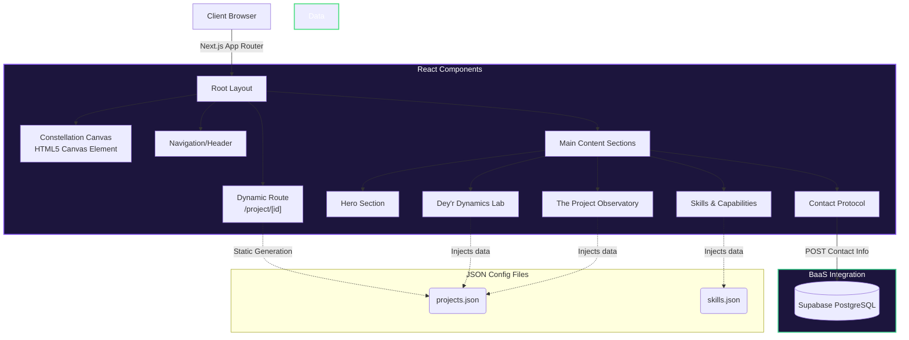
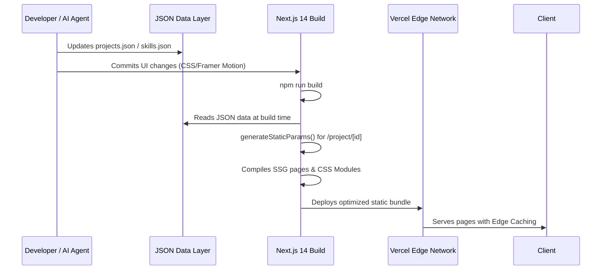

# 🔭 The Data Observatory — Souhrid Dey's Portfolio

<p align="center">
  
  
  
  
  
</p>

An immersive, storytelling-driven portfolio website designed around the metaphor of **"The Data Observatory"**. This digital portfolio highlights Souhrid Dey's interdisciplinary journey, spanning 6+ years of enterprise financial analytics (Maersk, Genpact, Eaton) and cutting-edge Data Science & Machine Learning (UT Austin McCombs / Great Lakes PGP, 4.07/4.33 GPA).

---

## 🌟 Key Highlights

- **The Data Observatory Metaphor**: Atmospheric, sleek dark-mode aesthetic with an interactive celestial-neural constellation canvas, cosmic violet lighting, and lens-focus scroll interactions powered by Framer Motion.
- **4-Tier Project Architecture**:
  - **Tier 1 (⭐ Hero)**: 4 flagship machine learning, predictive analytics, and visualization case studies with deep-dive metrics (Capstone Churn, US Visa, Shinkansen Satisfaction Hackathon Rank 2, Tableau Insurance Risk).
  - **Tier 2 (Supporting)**: Core unsupervised clustering (AllLife Bank), econometric regression (ShowTime OTT), and enterprise SQL analytics (New-Wheels).
  - **Tier 3 (Compact)**: Foundational analytics & hypothesis testing case studies (INN Hotels, Austo Automobiles, Inferential Statistics).
  - **Tier 4 (Dey'r Dynamics Lab)**: 3 modern agentic GenAI applications leveraging Google Gemini 2.0 Flash and Claude 3.5 Sonnet, highlighting autonomous LLM tool-calling.
- **Full Social & Platform Integration**: Direct verified connections to LinkedIn, GitHub, Kaggle, LeetCode, Tableau Public, and direct email.

---

## 🏗️ System Architecture & Workflow

This portfolio was engineered to bridge the gap between rigorous data science and modern, high-performance web development.

### Application Architecture



### Development & Build Workflow



---

## 🛠️ Repository Organization

```
portfolio-website/
├── public/                  # Static assets (fonts, generated images)
│   └── images/projects/     # Generated 16:9 project cover images
├── src/                     
│   ├── app/                 # Next.js 14 App Router layout & pages
│   │   └── project/[id]/    # Dynamic routing for project case studies
│   ├── components/          # Reusable React UI components (Hero, FadeIn, etc.)
│   ├── data/                # JSON Data Layer (skills, projects, experience)
│   ├── lib/                 # Utility functions and Supabase clients
│   └── styles/              # Global CSS tokens and modular component styles
├── references/              # Project research & public design guidelines
└── README.md                # System documentation
```

---

## 🚀 Getting Started

### Prerequisites
- Node.js 18.17+ or 20+
- npm or yarn

### Installation
```bash
# Clone repository
git clone https://github.com/Souhrid-Dey/portfolio-website.git
cd portfolio-website

# Install dependencies
npm install

# Run development server
npm run dev
```

Open [https://portfolio-website-kappa-two-12.vercel.app](https://portfolio-website-kappa-two-12.vercel.app) with your browser to explore the live observatory, or run locally on `http://localhost:3000`.

---

## 🔒 Privacy & Security

All internal ideation prompts, agentic instructions (`PROMPT.MD`), scratchpad workflows, and raw academic transcripts used to generate this context have been strictly excluded via `.gitignore` to maintain data privacy and professional operational security. 

---
*Uncovering the subtle patterns in complex data to drive high-impact strategic decisions.*
